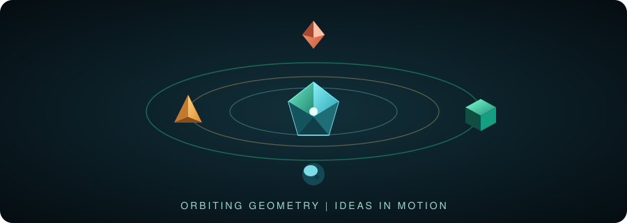
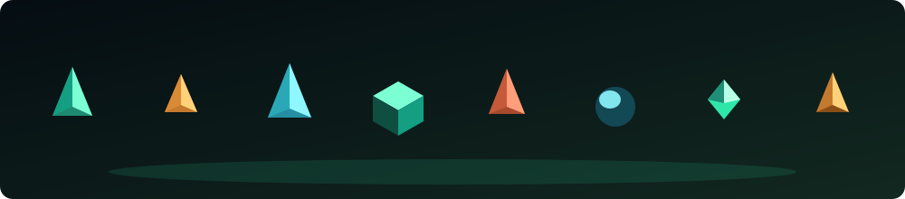
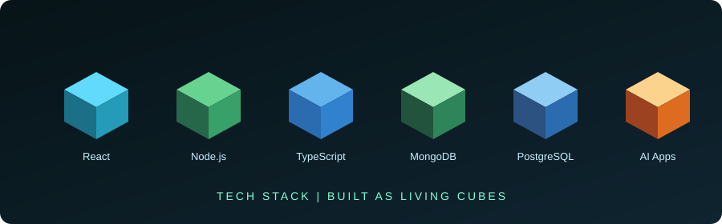
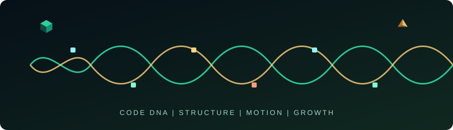

<!--
  GitHub Profile README � Abeer Pathela
  Repo must be named exactly: abeerpathela (same as your username)
  After first push: Actions ? "Generate 3D Profile Assets" ? Run workflow
-->

<div align="center">

  

  <br/>

  <a href="https://github.com/abeerpathela">
    
  </a>

  <p>
    <a href="https://abeerpathela.in/"></a>
    <a href="https://github.com/abeerpathela"></a>
    <a href="https://linkedin.com/in/abeer-pathela-240001313"></a>
  </p>

</div>

---

<div align="center">
  
</div>

### About me

Computer Science student at **Chitkara University** � building full-stack & AI-powered products with React, Node.js, TypeScript, PostgreSQL, and MongoDB.

I care about clean systems, sharp UI, and shipping things people can actually use.

<div align="center">
  
</div>

---

### Stack as living cubes

<div align="center">
  
</div>

<p align="center">
  
</p>

---

### Isometric lab

<div align="center">
  
</div>

---

### Dimensional portal

<div align="center">
  
</div>

---

### Code DNA

<div align="center">
  
</div>

---

### GitHub analytics

<div align="center">

  
  

  <br/>

  

</div>

---

### 3D contribution universe

> After you push this repo and run the **Generate 3D Profile Assets** workflow once, these graphs unlock automatically.

<div align="center">

  

  <br/><br/>

  

  <br/><br/>

  

</div>

---

### Contribution snake

<div align="center">
  <picture>
    <source media="(prefers-color-scheme: dark)" srcset="./dist/github-contribution-snake-dark.svg" />
    <source media="(prefers-color-scheme: light)" srcset="./dist/github-contribution-snake.svg" />
    
  </picture>
</div>

---

### What I'm into right now

```text
   ???????????????????????????????????????????????
   ?  ? Full-stack product builds (MERN + TS)    ?
   ?  ? AI-powered apps & smart workflows        ?
   ?  ? DSA + systems that stay fast                ?
   ?  ? Interfaces that feel dimensional         ?
   ???????????????????????????????????????????????
```

<div align="center">
  
</div>

---

<div align="center">

  

  <br/><br/>

  

  <h3>thanks for dropping into my little 3D corner of GitHub</h3>
  

</div>
